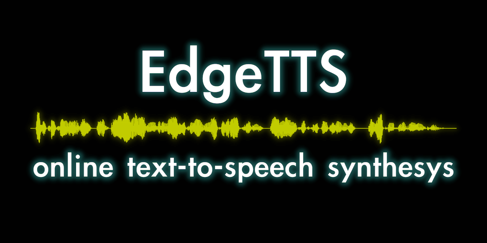

# edgetts

`edgetts` is a golang module that allows you to use Microsoft Edge's online text-to-speech service in your golang projects.

## Installation

To install it, run the following command:

```bash
go get github.com/kolonist/edgetts@latest
```

## Usage

### Speech synthesys to file

```go
package main

import (
	"context"
	"github.com/kolonist/edgetts"
)

func main() {
	args := edgetts.Args{
		// set voice to use in speech synthesys
		Voice: "en-US-AlloyTurboMultilingualNeural",
	}

	// generate sound in mp3 format and save it to the file
	err := edgetts.
		New(args).
		Speak("Text I need to speak now").
		SaveToFile(context.TODO(), "./sample.mp3", edgetts.OutputFormatMp3)
}
```

### Speech metadata

```go
package main

import (
	"context"
	"github.com/kolonist/edgetts"
)

func main() {
	args := edgetts.Args{
		// set voice to use in speech synthesys
		Voice: "en-US-AlloyTurboMultilingualNeural",

		// speak 15% faster
		Rate:  "+15%",

		// reduce the volume by 10%
		Volume: "-10%",
	}

	// set synthesys args and text
	speaker := edgetts.
		New(args).
		Speak("Text I need to speak now")

	// generate sound in raw PCM format with 22050 Hz sample rate and get sound chunks in iterator
	for data, err := range speaker.GetSoundIter(context.TODO(), edgetts.OutputFormatRaw22050) {
		// data is `[]byte`
		// you can use this method to stream audio as it came from Edge TTS server
	}

	// get info about timings of all words appearance and its duration in generated speech
	// note that you should call `GetMetadata()` after one of `GetSoundIter()`, `GetSound()` or `SaveToFile()`
	metadata, err := speaker.GetMetadata()

	for _, word := range metadata {
		// `Offset` and `Duration` are in milleseconds
		fmt.Printf("%d: %s - %d\n", word.Offset, word.Text, word.Duration)
	}
}
```

### Getting list of voices

```go
package main

import (
	"context"
	"github.com/kolonist/edgetts"
)

func main() {
	// get ;list of all available voices
	voices, err := edgetts.ListVoices(context.TODO())

	for i, v := range voices {
		// you should use `ShortName` in your speech generation Args
		fmt.Printf("ShortName: %s, Gender: %s", v.ShortName, v.Gender)
	}
}
```

You can find more complex example in [/examples](https://github.com/kolonist/edgetts/tree/main/examples) folder.

## API

### Constants:

#### Audio output formats (`OutputFormat`):

- `OutputFormatMp3` — mp3 24khz, 48k bitrate (default)
- `OutputFormatWebm` — webm 24khz, 16bit, 24k bitrate
- `OutputFormatOgg` — ogg 24khz, 16bit
- `OutputFormatRaw22050` — raw PCM 22050 hz, 16bit
- `OutputFormatRaw44100` — raw PCM 44100 hz, 16bit

### Structs:

#### `edgetts.Args`

Arguments to use in `edgetts.New(args edgetts.Args)` function.

##### Fields:

- `Voice string` — Voice.\
   Has format `en-US-AlloyTurboMultilingualNeural`, where:
   - `en-US` — locale
   - `AlloyTurbo` - actual voice name
- `Volume string` — Sound volume in percent. Can increase (`+10%`) or decrease (`-20%`) volume
- `Rate string` — Speech rate in percent. Can increase (`+30%`) or decrease (`-40%`) rate

#### `edgetts.EdgeTTS`

Struct to manage speech synthesys

##### Constructor

###### `New(args edgetts.Args) *edgetts.EdgeTTS`

Create `EdgeTTS` struct

##### Methods:

###### `Speak(text string) *Speaker`

Assign text you need to synthesize.

###### `SpeakWithVoice(text string, voice string) *Speaker`

Assign text you need to synthesize with defined voice. Can be helpful if you need multiple generations with different voices.

#### `edgetts.Speaker`

Used to synthesyze speech

##### Methods:

###### `GetSoundIter(ctx context.Context, format OutputFormat) iter.Seq2[[]byte, error]`

Get sound data as byte buffers in iterator

###### `GetSound(ctx context.Context, format OutputFormat) ([]byte, error)`

Get whole downloaded sound file as byte buffer

###### `SaveToFile(ctx context.Context, filename string, format OutputFormat) error`

Save to file generated sound

###### `GetMetadata() ([]SpeechMetadata, error)`

Get metadata of generated speech. Should be called after one of `GetSoundIter()`, `GetSound()` or `SaveToFile()`

#### `edgetts.SpeechMetadata`

Contains time of each word start and its pronunciation duration im milliseconds

##### Fields:

- `Offset int` — Start time of word in generated sound in milliseconds
- `Duration int` — Duration of word pronunciation in milliseconds
- `Text string` — Word

#### `edgetts.Voice`

Voice used for speech synthesys

##### Get list of voices:

###### `edgetts.ListVoices(ctx context.Context) ([]Voice, error)`

Get list of all possible voices

##### Fields:

- `Name string` — Voice full name
- `ShortName string` — Voice short name. You should use this value when specifying voice in this library functions 
- `Gender string` — Speaker gender, `Male` of `Female`
- `Locale string` — Locale, e.g. `en-US`
- `SuggestedCodec string` — always empty
- `FriendlyName string` — always empty
- `Status string` — Can be `GA` for General Availability or `Preview`
- `VoiceTag.ContentCategories []string` — always empty
- `VoiceTag.VoicePersonalities []string` — Vocal characteristics of voice

For speech synthesys you need only `ShortName` field

## Thanks

I used the following projects as sources of inspiration:

* https://github.com/rany2/edge-tts (similar library for Python)
* https://github.com/surfaceyu/edge-tts-go (Python library rewritten in Go but not working now)

## Author

@license MIT\
@version 1.0.0\
@author Alexander Zubakov <developer@xinit.ru>